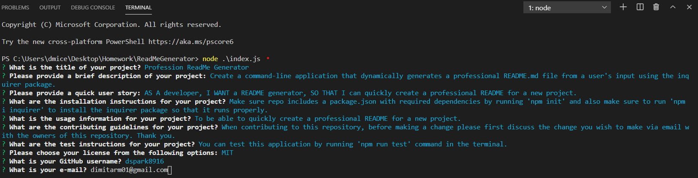

# ReadMeGenerator

## Importance of Good ReadMe

An important component of your GitHub profile and one that many new developers often overlook is the README.md file. The quality of a README often differentiates a good project from a bad project. A good one takes advantage of the opportunity to explain and showcase what your application does, justify the technologies used, and even talk about some of the challenges you faced and features you hope to implement in the future. A good README helps you stand out among the large crowd of developers putting their work on GitHub.

There's no one right way to structure a good README. There is one very wrong way, however, and that is to not include a README at all or to create a very anemic one.

## Description

Now that we now how important it is to have a good ReadMe, we can go in to what our task was for this assignment. We were asked to create a command-line application that dynamically generates a professional README.md file from a user's input using the Inquirer package.

## User Story

AS A developer
I WANT a README generator
SO THAT I can quickly create a professional README for a new project

## Tasks Completed

**List of Tasks Completed**

    1.

    2.

    3.

    4.

    5.

    6.

    7.

    8.

    9.

## Video Demonstration & ScreenShot

**Link to Video Demonstration**

[Video Demo](https://drive.google.com/file/d/1ICSPyYdwiPD3zHP7JDUAwarON7bHnyub/view)

**ScreenShot**

